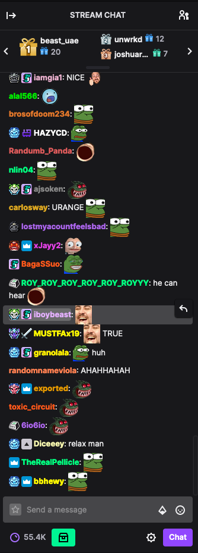

# Overview
TwitchBot is a set of executables for collecting, cleaning, and ultimately displaying an interactive Markov Chain visualization + text generator from a [twitch.tv](https://www.twitch.tv) chat dataset. 

Out of the box, TwitchBot contains a dataset of approximately one million chat messages collected from various Minecraft Speedrun streams from livestreamer [xQc](https://www.twitch.tv/xqcow) during the month of April.
# Setup
1. Unzip the twitch-bot.zip file.
2. Place the twitch-bot directory into your eclipse workspace directory.
3. In Eclipse, go to the Package Explore, right click, and hit New Java Project.
4. Name your new project twitch-bot and hit finish.
5. Press the run button in Eclipse to run the project!

## Advanced
This setup is for if you wish to train TwitchBot on a unique set of data collected from a different channel.
1. Unzip the twitch-bot.zip file.
2. In a bash shell, do:

    ```bash
    cd scripts
    npm install
    node scraper.js -c <channel name> -t <target filename>
    ```
    ...and stop the process when you have collected your desired number of messages. The data collected will be present in file `twitch-bot/data/<target filename>`<br /> 
    **Note:** the channel you wish to collect messages from must
    be live. <br />
    _Optionally_, run `node scraper.js -h` for a full list of arguments and an explanation of how to use the the scraper. <br />
    <span style="color:khaki">Warning:</span> the target file should be a `.csv` file.
3. Again in a bash shell, do:
    ```bash
    cd scripts
    python ./clean-data.py <target filename>
    ```
4. Your new set of data should now have been collected and cleaned. Proceed with the basic setup as usual to view the resulting Markov Chain!

# Visualizer Usage
The visualizer displays the Markov Chain and the sentence generator. In the Markov Chain each node is a word. An edge exists between a source and target node if the source word is proceeded by the target word in chat messages. The more blue an edge the more probable it is that the source word proceeds the target word.
## Controls
* `z` and `x` to zoom the camera in and out respectively. 
* Arrow keys to move the camera around.
* Press `generate sentence` to create a random message from the Markov Chain model. You may give it a custom length between 1 and 50 words, or have the message length be determined by a normal distribution around the average message length. <br />**Only** nodes who's word are in the message will be displayed in the graph.
* Press `clear sentence` to display the entire graph again.
## Code Settings
* In file `/src/utils/Constants.java` You may play around with various display settings. In particular `NUM_MESSAGES` may be set to the amount of messages you wish to build the Markov Chain with. ~200,000 is recommend for a smooth, accurate, and generally fast experience but the visualizer can handle 1,000,000. 
* In file `/src/vis/MarkovChainVisualizer.java` line 392, you may set the node spacial distribution pattern (Sunflower or Uniform Square). Uniform Square is recommended for large data sets.

# Output & Data Context Considerations
It's important to consider the context of the data collected. As mentioned before, the data came from streamer xQc's Minecraft Speedrun livestreams. As such, many Minecraft and Speedrunning terms are used frequently. Some common terms you'll see in the randomly generated messages are:
* _"reset"_: the current speedrun attempt is too slow and a new one should be started.
* _"run"_: the current speedrun attempt
* _"i was here"_: indicates the run is going very well 
* _"pearls, enderpearls, obsidian, rods, blaze rods, nether fortress, fortress, bastion, village, portal, ruined portal, golem, beds"_: various Minecraft items and structures important to the run

Additionally at the time xQc was trying to beat a time of 20:38, a record set by fellow streamer [Forsen](https://www.twitch.tv/forsen).


This is Forsen and many emotes in the output include his face. 

Another important consider is twitch itself. xQc's streams average around 80,000 viewers, and as such, twitch chat tends to move very fast. A message typed by a user may only be on screen for a few seconds. This tends to incentivize short, redundant messages with many emotes and usually all in upper case.



In fact, the average chat message length in the data we collected was only 5 words. Thus randomly generated messages often don't even seem intelligable. This is a feature inherited from the data set not a bug!
